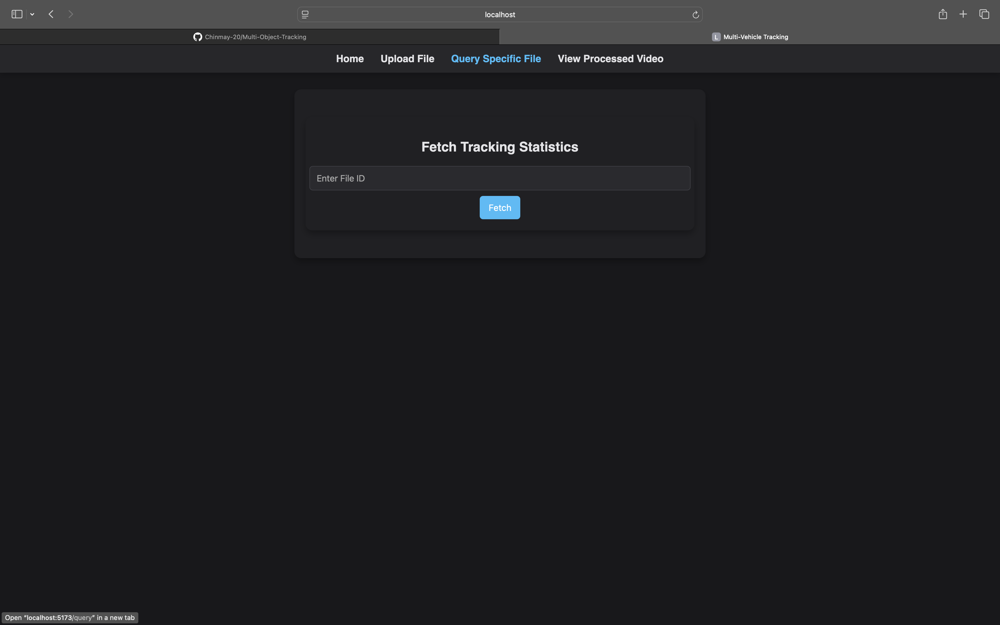
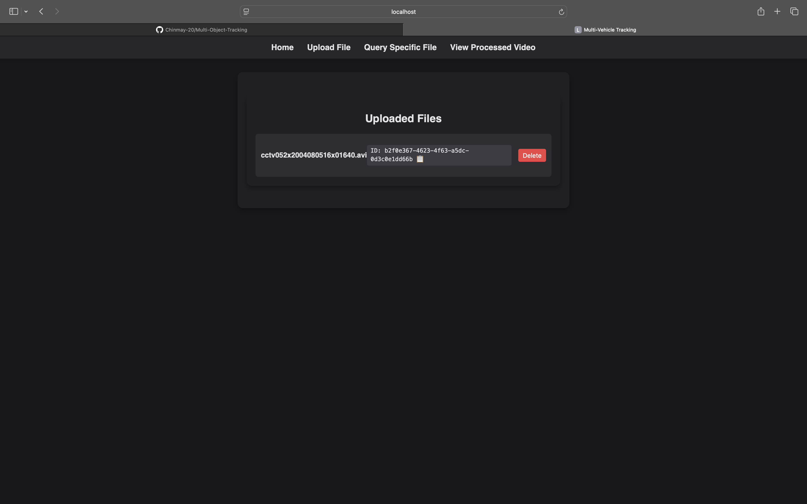
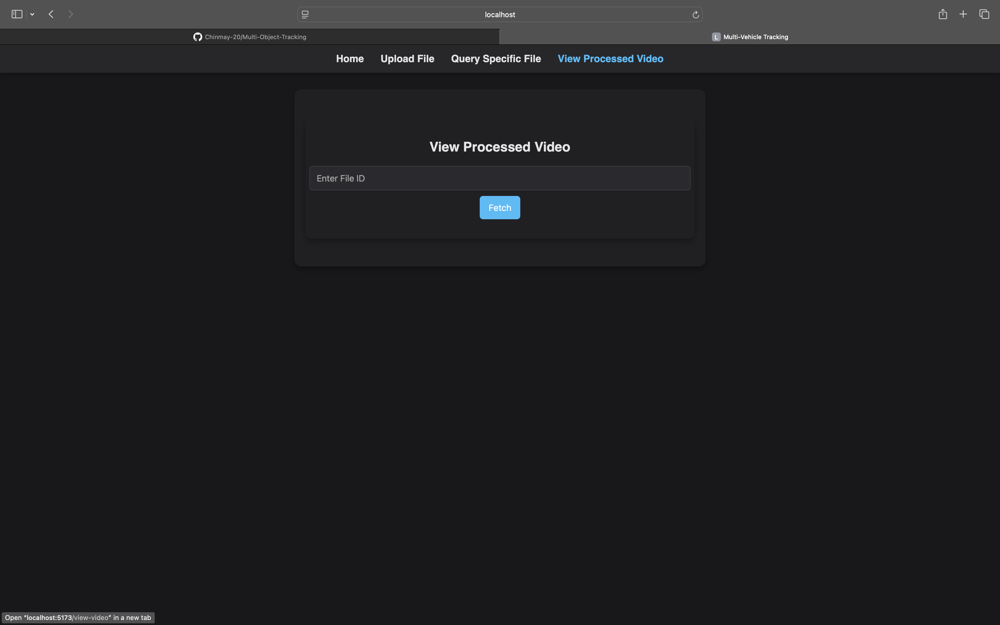
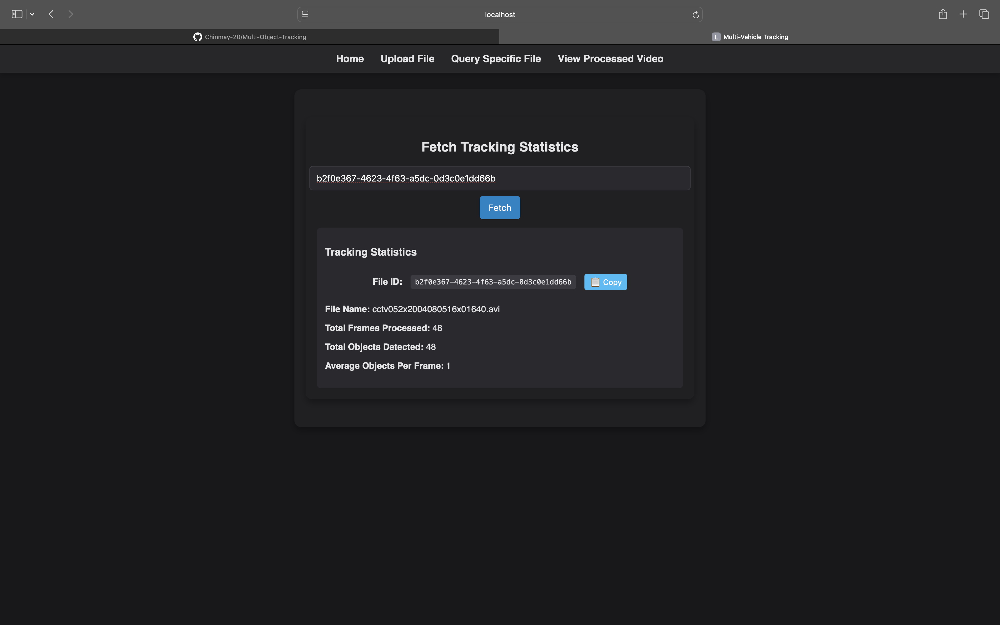
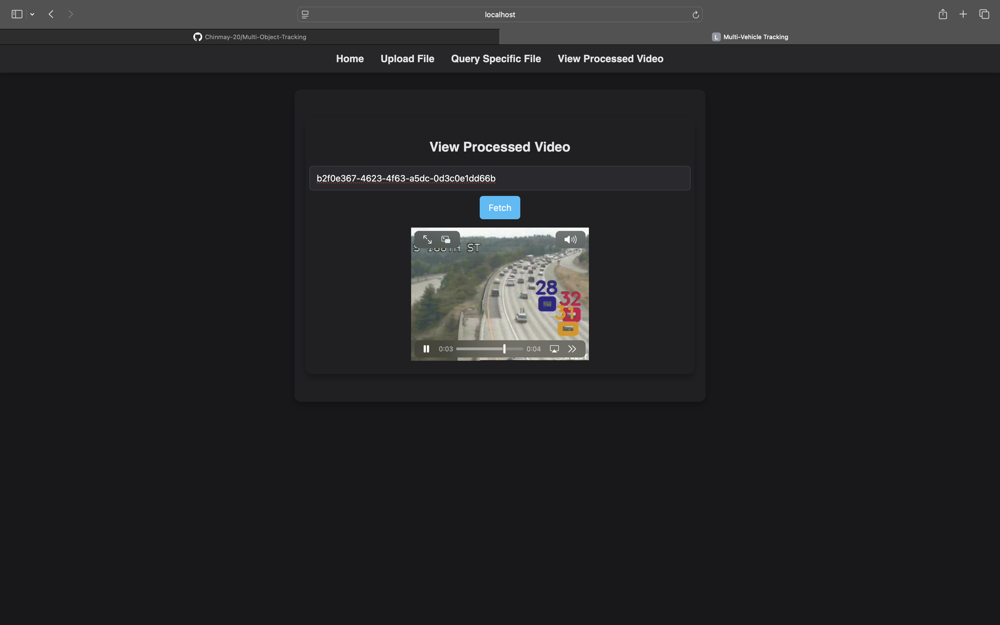

# Multi-Object Tracking Full-Stack System

[](https://opensource.org/licenses/MIT)
[](https://www.python.org/downloads/)
[](https://github.com/ultralytics/yolov5)
[](https://opencv.org/)
[](https://pytorch.org/)

## Overview

This is a **full-stack** multi-object tracking system built with **React (frontend) and Flask (backend)**, utilizing **YOLOv5** for object detection and a combination of multiple tracking metrics including the **Hungarian algorithm** for optimal association. The processed videos and related information are stored in **Amazon S3**, while **MongoDB** is used as the primary database to store metadata about the uploaded files.

## Key Features

- **Real-time object detection** using YOLOv5
- **Multi-metric tracking system** combining:
  - IoU (Intersection over Union)
  - Sanchez-Matilla distance
  - Yu exponential cost function
  - Deep feature matching using Siamese networks
- **Hungarian algorithm** for optimal detection-track association
- **Track management** with age-based filtering
- **Full-stack integration** with React frontend, Flask backend, MongoDB database, and AWS S3 for file storage
- **Unique file ID generation** upon upload, which allows retrieval of tracking statistics and processed videos

## System Architecture

### **Frontend (React + TypeScript)**
- Built with **Vite + TypeScript** for fast and modular development
- Provides a **user-friendly UI** to:
  - Upload files
  - Retrieve tracking statistics
  - View processed videos stored in **Amazon S3**

### **Backend (Flask + Python)**
- Handles **file uploads and processing**
- Stores **file metadata in MongoDB**
- Generates and returns a **unique file ID** for each uploaded file
- Provides APIs to **fetch tracking results** and **serve processed videos from S3**

### **Storage (AWS S3 + MongoDB)**
- **Amazon S3** stores processed video files
- **MongoDB** stores metadata including file ID, file name, and S3 links

## Project Structure

```
├── dataset/
│   ├── images/
│   ├── nvidia_ai_challenge_images/
│   └── surveillance_videos/
├── models/
│   ├── coco.names
│   ├── model640.pt
│   └── yolov5s.pt
├── object_tracking.py
├── object_tracking_api.py
├── siamese_net.py
├── requirements.txt
├── object-tracking-frontend/
│   ├── src/
│   │   ├── components/
│   │   ├── pages/
│   │   ├── assets/
│   │   ├── App.tsx
│   │   ├── Navbar.tsx
│   │   ├── UploadComponent.tsx
│   │   ├── FetchResults.tsx
│   │   ├── ViewVideo.tsx
│   ├── package.json
│   ├── vite.config.ts
│   ├── tsconfig.json
│   └── README.md
└── README.md
```

## Installation

1. Clone the repository:
   ```bash
   git clone https://github.com/yourusername/object-tracking.git
   cd object-tracking
   ```

2. Setup the **backend**:
   ```bash
   python -m venv venv
   source venv/bin/activate  # On Windows: venv\Scripts\activate
   pip install -r requirements.txt
   ```

3. Setup the **frontend**:
   ```bash
   cd object-tracking-frontend
   npm install
   npm run dev
   ```

## Usage

### Uploading a File
- Navigate to the **Upload File** page.
- Upload a video file.
- A **unique file ID** will be generated and stored in the database.

### Querying a File ID
- The **Home page** displays all stored file IDs.
- The user can copy a file ID and use it to fetch **tracking statistics**.

### Viewing Processed Video
- The **processed video** is stored in **S3**, and the link is retrieved from **MongoDB**.
- Enter a **File ID** in the **View Processed Video** page to watch the processed result.

## Screenshots

### Uploading a File


### Querying Tracking Statistics


### Viewing Processed Video


### Home Page with Stored Files


### Copy File ID Feature


### Processed Video Example


## Performance Metrics

- **Processing Speed:** ~20-30 FPS (hardware-dependent)
- **Detection Accuracy:** >90% mAP@0.5 (YOLOv5s)
- **Tracking Robustness:** Effectively handles occlusions and object interactions

## Technical Considerations

### Memory Management
- Efficient frame processing with OpenCV
- Batch processing for feature extraction
- GPU acceleration supported for both detection and feature extraction

### Optimization
- Vectorized operations for cost matrix computation
- Hungarian algorithm for efficient tracking
- Parallel processing of detection and feature extraction

## Contributing

1. Fork the repository
2. Create your feature branch (`git checkout -b feature/amazing-feature`)
3. Commit your changes (`git commit -m 'Add amazing feature'`)
4. Push to the branch (`git push origin feature/amazing-feature`)
5. Open a Pull Request

